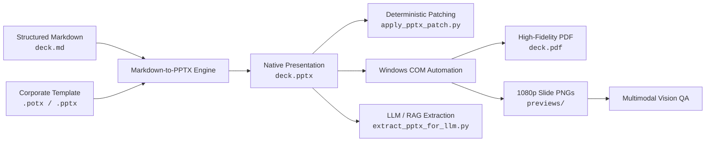

# 📊 PPTX Editor — Agent & Developer PowerPoint Toolkit

[](LICENSE)
[](https://python.org)
[]()
[]()

> **Deterministic, Template-Aware PowerPoint Engineering for AI Agents & Developers.**  
> Create, inspect, patch, and export presentations programmatically with millimeter precision, structured JSON envelopes, and headless multimodal vision verification.

---

## ✨ Key Capabilities

- 📝 **Markdown-to-Presentation Engine (`markdown_to_pptx.py`)**  
  Write presentations in pure Markdown with YAML frontmatter. Supports multi-column layouts, tables, speaker notes, and dynamic layout placeholder inheritance (`.pptx` and `.potx`).
- 🔍 **Hierarchical LLM Extraction (`extract_pptx_for_llm.py`)**  
  Parses complex slides into clean, predictable JSON schemas (`pptx-structure.v1` and RAG chunks) optimized for LLM context windows and vector retrieval.
- 🎯 **Deterministic Preconditioned Patching (`apply_pptx_patch.py`)**  
  Safely mutate slides without breaking layouts, fonts, or master themes. Enforces pre-conditions (`expected_old_title`, `expected_contains`) to guarantee zero-risk mutations.
- 📐 **Template & Layout Preservation (`pptx_ops.py`)**  
  Native support for PowerPoint templates (`.potx`) and presentation masters (`.pptx`). Clones slide number and footer placeholders directly into master layout geometries.
- 📸 **Multimodal Vision QA via Windows COM (`export_pptx_to_images.ps1`)**  
  Headless batch rendering of slides to 1080p PNG images and high-fidelity PDFs for automated visual QA with vision-capable multimodal AI models.
- 🛡️ **Zero-Residual Testsuite (`selftest.py`)**  
  Self-contained end-to-end regression suite verifying the entire pipeline in temporary sandboxes.

---

## 🔄 Architecture & Lifecycle



---

## 🚀 Quick Start

### 1. Installation
```bash
pip install -r requirements.txt
```

### 2. Generate a Deck from Markdown
Use the included ready-to-use template [`templates/presentation-template.md`](templates/presentation-template.md):

```bash
python scripts/markdown_to_pptx.py \
  --in templates/presentation-template.md \
  --out presentation.pptx \
  --template templates/default-presentation.pptx
```

### 3. Extract Slide Structure for LLM Context
```bash
python scripts/extract_pptx_for_llm.py \
  --in presentation.pptx \
  --out structure.json \
  --rag-output chunks.json
```

### 4. Patch Slides with Preconditions
```bash
python scripts/apply_pptx_patch.py \
  --in presentation.pptx \
  --out updated.pptx \
  --patch patch.json
```

### 5. Export to PDF & Visual Inspection Images (Windows)
```powershell
# Headless PDF export
pwsh -ExecutionPolicy Bypass -File scripts/export_pptx_to_pdf.ps1 -InputPath presentation.pptx -OutputPath presentation.pdf

# 1080p PNG slide rendering for vision models
pwsh -ExecutionPolicy Bypass -File scripts/export_pptx_to_images.ps1 -InputPath presentation.pptx -OutputDir ./previews
```

---

## 📋 Markdown Syntax & Conventions

PPTX Editor translates standard Markdown syntax into professional slide decks:

```markdown
---
presenter: "Jane Doe"
event: "Global Tech Summit 2026"
date: "15.10.2026"
title_slide_number: false   # false = title slide unnumbered; true = numbered
---

# Building Resilient AI Agents
## From Proof-of-Concept to Production Systems

> Notes: Welcome the attendees and introduce the core thesis of the talk.

---

# Architecture Comparison
## Evaluating Trade-offs

## Column 1: Monolithic Chatbot
- **Stateless:** Context lost across extended sessions.
- **Black-box:** Difficult to audit internal decisions.
- **Vendor Lock-in:** Tied to specific model APIs.

## Column 2: Agentic Workspace
- **Persistent State:** File-based operational memory.
- **Auditable Gates:** Transparent verification checklists.
- **Harness Agnostic:** Interchangeable foundation models.

> Notes: Emphasize the architectural transition to decoupled workspaces.

---

# Benchmark Results
## Execution Metrics

| Scenario | Autonomous Pass Rate | Latency (s) | Cost ($) |
| :--- | :--- | :--- | :--- |
| Single Prompt | 42.1% | 1.8s | $0.02 |
| Chained Workflow | 78.4% | 5.2s | $0.08 |
| **Agentic Workspace** | **96.7%** | **12.4s** | **$0.14** |
```

---

## 🧰 Script Directory Reference

| Script | Purpose | Key Flags |
| :--- | :--- | :--- |
| [`scripts/markdown_to_pptx.py`](scripts/markdown_to_pptx.py) | Compiles Markdown into PowerPoint with layout matching | `--in`, `--out`, `--template`, `--strict-footer` |
| [`scripts/pptx_to_markdown.py`](scripts/pptx_to_markdown.py) | Disassembles PowerPoint decks into structured Markdown | `--in`, `--out` |
| [`scripts/extract_pptx_for_llm.py`](scripts/extract_pptx_for_llm.py) | Extracts structural hierarchy & RAG chunks as JSON | `--in`, `--out`, `--rag-output` |
| [`scripts/apply_pptx_patch.py`](scripts/apply_pptx_patch.py) | Atomic preconditioned patching of slides and tables | `--in`, `--out`, `--patch` |
| [`scripts/pptx_ops.py`](scripts/pptx_ops.py) | CLI utility for text, stats, search-replace, and inspection | `stats`, `text`, `replace`, `inspect`, `convert-template` |
| [`scripts/export_pptx_to_pdf.ps1`](scripts/export_pptx_to_pdf.ps1) | Headless Windows COM conversion to PDF | `-InputPath`, `-OutputPath` |
| [`scripts/export_pptx_to_images.ps1`](scripts/export_pptx_to_images.ps1) | Headless Windows COM rendering to 1080p PNGs | `-InputPath`, `-OutputDir` |
| [`scripts/selftest.py`](scripts/selftest.py) | Zero-residual automated regression testsuite | (No args required) |

---

## 🔒 Deterministic Patching & Safety Preconditions

When AI agents mutate existing presentations, inadvertent layout breakage or unintended overwrites are catastrophic. PPTX Editor uses a strict **precondition gate**:

```json
{
  "ops": [
    {
      "op": "set_slide_title",
      "slide_number": 2,
      "title": "New Validated Title",
      "expected_old_title": "Draft Title"
    },
    {
      "op": "replace_text",
      "slide_number": 3,
      "find": "Draft v1",
      "replace": "Release v1.0",
      "expected_matches": 1
    }
  ]
}
```

If `expected_old_title` or `expected_matches` do not match reality, the operation **fails safely** without writing any changes to disk.

---

## 📁 Recommended Workspace Presentation Structure

For multi-event or multi-audience projects:

```
presentations/<topic-slug>/
├── README.md                           # Topic overview & event catalogue
├── master/                             # Canonical master presentation
│   ├── deck.md                         # Master content
│   ├── deck.pptx                       # Master PowerPoint
│   └── deck.pdf                        # Master PDF
└── events/                             # Event instances & variations
    ├── 2026-10-15_global-tech-summit/
    │   ├── deck.md                     # Tailored deck with event frontmatter
    │   ├── deck.pptx                   # Event presentation
    │   ├── deck.pdf                    # PDF for distribution
    │   └── previews/                   # 1080p slide review images
    └── <YYYY-MM-DD>_<event-slug>/
        ├── deck.md
        ├── deck.pptx
        ├── deck.pdf
        └── previews/
```

---

## 🧪 Verification & Regression Testing

Run the automated self-test at any time:

```bash
python scripts/selftest.py
```

All 7 pipeline stages are validated in isolation with zero residual test files left in the workspace.

---

## 📄 License

This project is open-source under the [MIT License](LICENSE).
